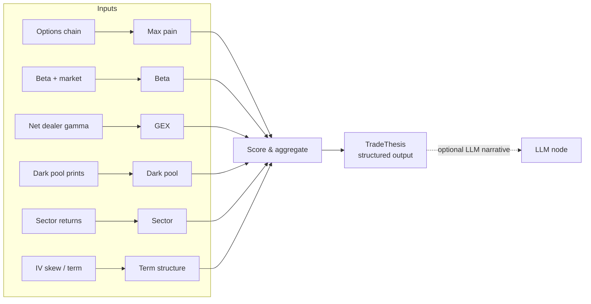
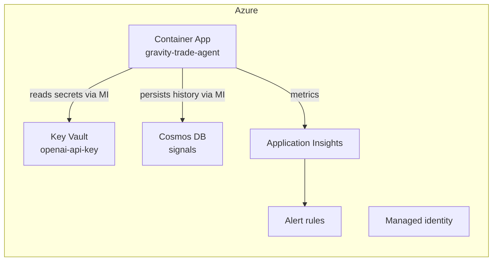

# Gravity Trade Agent

A [LangChain](https://python.langchain.com/) / [LangGraph](https://langchain-ai.github.io/langgraph/) agent that implements the **Gravity Trade** six-layer directional framework — a systematic way to score whether an equity is set up for a bullish, bearish, or neutral weekly move.

It runs a six-signal scan (max pain, beta, GEX, dark-pool flow, sector, term structure), aggregates the results into a 0–6 conviction score, and emits a structured trade thesis with cited evidence. The pipeline is **offline-first**: every layer is deterministic pure Python, so the whole thing runs with zero API keys. An LLM is optional and only used to write the narrative.

[](LICENSE)
[](pyproject.toml)

---

## Why this exists

Directional options traders spend too much time stitching together disconnected
signals — max-pain pins from one source, gamma exposure from another, dark-pool
prints from a third. The Gravity Trade framework compresses six of those signals
into one number (0–6 conviction) plus a direction, and it only asks you to act
when the layers agree.

The interesting engineering here is not the indicators themselves — it's the
**orchestration**: turning six independent data sources into structured,
verifiable, *cited* output through an agent graph, with an eval loop that
measures whether the signal actually predicts direction.

---

## The six layers

| Layer | Question it answers | Bullish read | Bearish read |
|-------|---------------------|--------------|--------------|
| **Max pain** | Where does the options market pin price? | price below the pin (magnet up) | price above the pin (magnet down) |
| **Beta** | Does the name amplify the tape? | high beta in an up market | high beta in a down market |
| **GEX** | Do dealers damp or amplify moves? | negative GEX + up momentum (trend) | negative GEX + down momentum |
| **Dark pool** | Are institutions accumulating or distributing? | net buy notional | net sell notional |
| **Sector** | Is the name leading or lagging? | leading a strong sector | lagging a weak sector |
| **Term structure** | What does volatility skew say? | call skew (bullish speculation) | put skew (bearish hedging) |

Each layer returns a `+1 / 0 / -1` score, a 0–1 confidence, and the raw numbers
it used as evidence. The six scores roll up into:

- **Conviction** = `max(bullish_count, bearish_count)` — 0 to 6
- **Direction** = net bias (bull / bear / neutral)
- **High conviction** = conviction ≥ 4 (the "4-of-6" bar)

See [docs/framework.md](docs/framework.md) for the full rationale behind each layer.

---

## Architecture

The offline path is a pure function: `data → six layers → score → thesis`. The
agent path wraps the same layers as LangChain tools inside a LangGraph graph so
an LLM can reason over the evidence (and optionally pull a live ticker).



---

## Quickstart

Requires Python 3.11+ and [`uv`](https://docs.astral.sh/uv/).

```bash
git clone https://github.com/emory-usc/gravity-trade-agent.git
cd gravity-trade-agent

# install (core only — no LLM needed)
uv sync

# run the deterministic scan on bundled sample data
uv run gravity analyze NVDA

# run the LangGraph agent (uses LLM if OPENAI_API_KEY is set, else offline fallback)
uv run gravity agent NVDA

# run the eval harness over the sample trade log
uv run gravity backtest

# run the test suite
uv run pytest
```

No API key required for any of the above. To enable the LLM narrative, copy
`.env.example` to `.env` and set `OPENAI_API_KEY`.

---

## Sample output

```
$ uv run gravity analyze NVDA

   NVDA — six-layer scan
┌──────────────┬──────┬───────┬──────┬──────────────────────────────────────────────┐
│ Layer        │ Dir  │ Score │ Conf │ Rationale                                     │
├──────────────┼──────┼───────┼──────┼──────────────────────────────────────────────┤
│ max_pain     │  —   │  +0   │ 0.12 │ Max pain 142.00 vs price 141.50 (pinned) …   │
│ beta         │  ▲   │  +1   │ 0.36 │ Beta 1.82 amplifies a positive tape …        │
│ gex          │  ▲   │  +1   │ 1.00 │ Negative GEX ($-1.9M) amplifies momentum …   │
│ dark_pool    │  ▲   │  +1   │ 1.00 │ Net dark pool flow +$11.58M (+69.4%) …       │
│ sector       │  ▲   │  +1   │ 0.62 │ Semiconductors +1.48%; ticker +2.10% …       │
│ term_structure│ ▲   │  +1   │ 0.80 │ Call skew -3.0 pts; term backwardated …      │
└──────────────┴──────┴───────┴──────┴──────────────────────────────────────────────┘

 BULL  conviction 5/6  (5 bull / 0 bear)  high-conviction: YES
```

---

## Project structure

```
gravity-trade-agent/
├── src/gravity_trade/
│   ├── signals/           # the six deterministic signal layers
│   ├── models.py          # Pydantic structured outputs (SignalBundle, TradeThesis)
│   ├── scoring.py         # aggregate six layers → conviction + direction
│   ├── thesis.py          # deterministic thesis generator (offline fallback)
│   ├── tools.py           # LangChain @tool wrappers around the layers
│   ├── agent.py           # LangGraph agent (scan → thesis)
│   ├── evals/             # backtest / hit-rate harness
│   ├── data.py            # bundled sample-data loader
│   ├── server.py          # FastAPI service (production entrypoint)
│   ├── secret_store.py    # Key Vault via managed identity (.env fallback)
│   ├── state_store.py     # Cosmos DB persistence (local fallback)
│   ├── telemetry.py       # App Insights metrics (logging fallback)
│   ├── config.py          # env-driven settings
│   └── cli.py             # typer CLI (analyze / agent / backtest / serve)
├── infra/                 # Bicep: Container Apps, Key Vault, Cosmos, App Insights, alerts
├── Dockerfile             # multi-stage, non-root, healthcheck
├── data/sample/           # illustrative ticker snapshots (NVDA, SPY)
├── evals/                 # sample trade log for the harness
├── tests/                 # pytest suite
└── docs/                  # framework + Azure deployment walkthroughs
```

---

## Azure deployment

The same pipeline ships as a containerized HTTP service on Azure — reflecting
how it actually runs in production.



Resources (all defined in `infra/main.bicep`):

- **Container Apps** — runs the FastAPI service (`/health`, `/ready`, `/analyze/{ticker}`) with liveness + readiness probes, API-key auth, scale-to-zero (0→3), and a user-assigned managed identity.
- **Key Vault** — RBAC + purge-protected, **private endpoint only**; holds the OpenAI + service API keys, read via managed identity (never in the image or `.env`).
- **Cosmos DB (serverless)** — **private endpoint only**; every `SignalBundle` / `TradeThesis` is persisted, partitioned by ticker, for replay and eval.
- **VNet + private endpoints** — app egress and PaaS access stay on a private network (`publicNetworkAccess: Disabled` on Key Vault and Cosmos).
- **Application Insights + Log Analytics** — conviction/direction/error metrics and logs, exported via OpenTelemetry.
- **Alert rules** — CPU health alert + a scan-error log alert, wired to an action group.

Full walkthrough — build/push, `bicep` deploy, secret injection, networking,
and the bare-metal VM alternative — in [docs/deployment.md](docs/deployment.md).
See [SECURITY.md](SECURITY.md) for the security posture.

## Evaluation

`gravity backtest` replays a paper-trade log through the framework's output and
reports hit rate by conviction tier. The key hypothesis: **higher conviction
predicts direction better than lower conviction.** The harness makes that
measurable.

The bundled log is illustrative sample data (see `evals/README.md`); swap in a
real log to evaluate a live strategy.

---

## Design notes

- **Offline-first.** Every signal layer is pure Python over a JSON snapshot, so
  the pipeline is reproducible, testable, and free to run. The LLM is an
  optional narrative layer, not a dependency of the core logic.
- **Structured output end-to-end.** Pydantic models are the single source of
  truth; the LLM is constrained to the `TradeThesis` schema with
  `with_structured_output`, so the agent can never emit a malformed thesis.
- **Cited evidence.** Every thesis cites the numbers behind each layer rather
  than asserting a direction without support.
- **Deterministic fallback.** The LangGraph agent degrades gracefully to the
  rule-based generator when no API key is present.

## Disclaimer

This is a research and educational project, **not financial advice**. The
bundled market snapshots and trade log are illustrative synthetic examples.
Nothing here is a recommendation to buy or sell any security.

## License

Released under the [MIT License](LICENSE). Copyright (c) 2026 Emory Long.

The software is provided "as is", without warranty of any kind, express or
implied — see [LICENSE](LICENSE) for the full terms and disclaimer.
